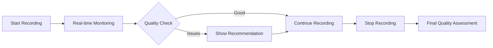
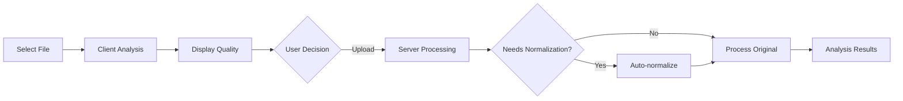

# Audio Level Processing & Quality Enhancement System

## Overview

Our audio analysis system includes comprehensive audio level monitoring and automatic quality enhancement to ensure optimal speech recognition accuracy. The system provides real-time quality checks during recording, pre-upload validation, and automatic normalization for suboptimal audio levels.

## Core Components

### 1. Client-Side Audio Quality Analysis
**Location**: `face-landing/utils/audioQualityAnalysis.ts`

**Key Features**:
- **AudioAnalysisResult Interface**:
  - `rmsLevel`: RMS level in dB
  - `peakLevel`: Peak level in dB  
  - `duration`: Audio duration in seconds
  - `sampleRate`: Sample rate in Hz
  - `qualityStatus`: 'good' | 'quiet' | 'loud' | 'very_quiet' | 'clipping'
  - `recommendation`: Optional user guidance string

- **ClientAudioAnalyzer Class**:
  - Web Audio API integration for browser-based analysis
  - AudioBuffer processing for level calculations
  - Quality score generation (0-100 scale)
  - Normalization need detection
  - Resource cleanup management

**Quality Thresholds**:
```typescript
// Quality assessment thresholds (in dB)
if (peakDb > -0.1) return 'clipping';      // Audio distortion detected
if (rmsDb < -40) return 'very_quiet';      // Requires normalization
if (rmsDb < -25) return 'quiet';           // Normalization recommended
if (rmsDb > -8) return 'loud';             // High but acceptable
return 'good';                             // Optimal range: -25 to -8 dB
```

**Quality Scores**:
- Good: 100
- Loud: 85
- Quiet: 75
- Very Quiet: 40
- Clipping: 30

### 2. Real-Time Recording Monitoring
**Location**: `face-landing/hooks/useAudioVisualization.ts`

**Features**:
- Live audio stream analysis during recording
- Dual-domain analysis (frequency and time)
- Visual level calculation (0-1 normalized)
- RMS and peak level monitoring in dB
- Real-time quality status updates
- Dynamic user recommendations

**Implementation Details**:
```typescript
interface AudioQualityMetrics {
  audioLevel: number;        // Visual level (0-1)
  rmsLevel: number;         // RMS level in dB
  peakLevel: number;        // Peak level in dB
  qualityStatus: 'good' | 'quiet' | 'loud' | 'very_quiet' | 'clipping';
  recommendation?: string;
}
```

**Real-Time Recommendations**:
- `very_quiet`: "Speak louder or move closer to microphone"
- `quiet`: "Speak a bit louder for better quality"
- `loud`: "Lower your voice or move back from microphone"
- `clipping`: "Audio is too loud - reduce input level"

**Technical Configuration**:
- FFT Size: 256 (configurable)
- Smoothing Time Constant: 0.8
- Animation frame-based updates for smooth visualization
- Automatic AudioContext management

### 3. Audio Recorder Component
**Location**: `face-landing/components/audio/AudioRecorder.tsx`

**Recording Settings**:
```javascript
audio: {
  echoCancellation: true,
  noiseSuppression: true,
  sampleRate: 16000  // Optimized for speech
}
```

**Visual Feedback System**:
- **Color-Coded Quality Indicators**:
  - 🟢 Green: Good audio level
  - 🟡 Yellow: Quiet audio
  - 🟠 Orange: Loud audio
  - 🔴 Red: Very quiet or clipping

- **Live Metrics Display**:
  - Real-time dB level display
  - Dynamic level meter (scales with audio input)
  - Quality status text updates
  - Toast notifications for recommendations

**User Interface Elements**:
- Pulsing record button (scales with audio level)
- Horizontal level meter with color transitions
- dB readout (e.g., "-21dB")
- Status messages (e.g., "✓ Good audio level")
- Recommendation alerts with 💡 icon

### 4. File Upload Component
**Location**: `face-landing/components/audio/FileUploader.tsx`

**Pre-Upload Analysis Flow**:
1. File selection triggers immediate analysis
2. AudioAnalyzer processes file using Web Audio API
3. Quality metrics calculated and displayed
4. Duration validation (max 15 minutes default)
5. Toast notifications based on quality:
   - ✅ Success: "Audio quality is good!"
   - ⚠️ Warning: "Audio is quiet/very quiet"
   - ❌ Error: "Audio is clipping"

**Quality Information Display**:
- Visual quality badge
- RMS/Peak level details
- Duration and file size
- Recommendations if needed

### 5. Server-Side Audio Processing
**Location**: `brains/audio_analysis_processor.py`

**Core Methods**:

#### `analyze_audio_levels(file_path: str)`
- Uses librosa for professional audio analysis
- Calculates RMS using `librosa.feature.rms()`
- Determines peak amplitude
- Converts to dB scale with floor protection
- Returns comprehensive analysis dict:
  ```python
  {
    'rms_level_db': float,
    'peak_level_db': float,
    'quality_status': str,
    'needs_normalization': bool,
    'recommendation': str,
    'duration': float
  }
  ```

#### `normalize_audio_file(input_path: str, output_path: str)`
- FFmpeg loudnorm filter implementation
- EBU R128 standard compliance
- Settings: `loudnorm=I=-16:LRA=11:TP=-1.5`
  - I=-16: Integrated loudness target (LUFS)
  - LRA=11: Loudness range
  - TP=-1.5: True peak limit (dBTP)
- Post-normalization quality verification
- Returns success status with analysis

#### Quality Assessment Logic:
```python
def _assess_audio_quality(self, rms_db: float, peak_db: float) -> str:
    if peak_db > -1:
        return 'clipping'
    elif rms_db < -40:
        return 'very_quiet'
    elif rms_db < -25:
        return 'quiet'
    elif rms_db > -8:
        return 'loud'
    else:
        return 'good'
```

### 6. Audio Analysis Pipeline Integration
**Location**: `brains/audio_analysis_endpoints.py`

**Processing Workflow**:
1. **Initial Level Analysis** (Line 1040-1042):
   - Analyze uploaded/recorded audio levels
   - Log quality status and metrics

2. **Normalization Decision** (Line 1044-1077):
   - Check if `needs_normalization` flag is true
   - Create normalized file path (`_normalized.mp3`)
   - Apply FFmpeg normalization if needed
   - Fall back to original if normalization fails

3. **Enhanced Processing** (Line 1078-1089):
   - Use optimal audio (original or normalized)
   - Process through full linguistic analysis pipeline
   - Preserve both original and normalized metrics

**Metadata Structure**:
```python
{
  'normalization_applied': bool,
  'original_levels': {
    'rms_level_db': float,
    'peak_level_db': float,
    'quality_status': str
  },
  'normalized_levels': {
    'rms_level_db': float,
    'peak_level_db': float,
    'quality_status': str
  }
}
```

## Features Using Audio Quality Checks

### 1. Live Recording Session
- **Real-time monitoring** during recording
- **Visual feedback** with color-coded indicators
- **Live recommendations** for optimal recording
- **Quality metrics** displayed in real-time

### 2. File Upload Processing
- **Pre-upload validation** with immediate feedback
- **Quality assessment** before server processing
- **Duration checking** alongside quality validation
- **User notifications** based on quality status

### 3. Backend Analysis Pipeline
- **Automatic normalization** for suboptimal audio
- **Quality-adjusted processing** for better accuracy
- **Metadata preservation** of quality metrics
- **Fallback handling** for processing failures

## Quality Status Actions

| Status | RMS Range (dB) | Action | User Message |
|--------|---------------|---------|--------------|
| **Good** | -25 to -8 | Process as-is | "Audio quality is good!" |
| **Quiet** | -40 to -25 | Recommend normalization | "Audio is quiet but should work" |
| **Very Quiet** | < -40 | Auto-normalize | "Audio is very quiet, normalizing..." |
| **Loud** | > -8 | Process with warning | "Audio levels are high but acceptable" |
| **Clipping** | Peak > -0.1 | Error warning | "Audio is clipping, re-record recommended" |

## User Experience Flow

### Recording Flow


### Upload Flow


## Technical Implementation

### Frontend Dependencies
- **Web Audio API**: Browser-based audio processing
- **AudioContext**: Real-time audio analysis
- **AnalyserNode**: Frequency and time domain analysis
- **MediaRecorder API**: Audio recording functionality

### Backend Dependencies
- **librosa**: Professional audio analysis library
- **FFmpeg**: Audio normalization and processing
- **NumPy**: Numerical computations
- **asyncio**: Asynchronous processing

### Database Schema
Audio quality metrics are stored in:
- `audio_processing_jobs` table
- `audio_analysis_results` table
- Session metadata includes quality status

## Benefits & Impact

### Improved Analysis Accuracy
- **Consistent input levels** for STT processing
- **Reduced transcription errors** from quiet audio
- **Better linguistic analysis** with normalized audio
- **Standardized processing** across all inputs

### User Experience
- **No technical knowledge required** - automatic optimization
- **Real-time guidance** during recording
- **Transparent processing** with clear feedback
- **Quality assurance** before submission

### System Reliability
- **Automatic quality control** at every stage
- **Graceful degradation** with fallback options
- **Error prevention** through early detection
- **Consistent results** regardless of input quality

## Configuration & Customization

### Configurable Parameters
- Quality thresholds (dB levels)
- Normalization targets (LUFS)
- Maximum file duration
- Sample rate preferences
- FFT size for visualization

### Environment Variables
- Audio processing timeouts
- Normalization enable/disable
- Quality check strictness
- Debug logging levels

## Future Enhancements

### Planned Features
- Advanced noise reduction algorithms
- Voice activity detection (VAD)
- Multi-speaker level balancing
- Historical quality tracking
- Adaptive threshold learning

### Potential Improvements
- GPU-accelerated processing
- Real-time noise cancellation
- Automatic gain control (AGC)
- Spectral analysis features
- Quality prediction models

## Related Files

### Frontend
- `/face-landing/utils/audioQualityAnalysis.ts` - Core analysis utilities
- `/face-landing/hooks/useAudioVisualization.ts` - Real-time monitoring hook
- `/face-landing/components/audio/AudioRecorder.tsx` - Recording interface
- `/face-landing/components/audio/FileUploader.tsx` - Upload interface

### Backend
- `/brains/audio_analysis_processor.py` - Main processing logic
- `/brains/audio_analysis_endpoints.py` - API endpoints
- `/brains/master_schema.sql` - Database schema

### Configuration
- `/face-landing/config/audio-analysis.config.ts` - Frontend settings
- Quality thresholds and processing parameters

---

## Complete Implementation Guide

### Step 1: Create Client-Side Audio Analysis Utility
**File**: `face-landing/utils/audioQualityAnalysis.ts`

```typescript
/**
 * Complete implementation of client-side audio analysis
 */

export interface AudioAnalysisResult {
  rmsLevel: number;
  peakLevel: number;
  duration: number;
  sampleRate: number;
  qualityStatus: 'good' | 'quiet' | 'loud' | 'very_quiet' | 'clipping';
  recommendation?: string;
}

export class ClientAudioAnalyzer {
  private audioContext: AudioContext | null = null;

  constructor() {
    if (typeof window !== 'undefined') {
      const AudioContextClass = window.AudioContext || (window as any).webkitAudioContext;
      if (AudioContextClass) {
        this.audioContext = new AudioContextClass();
      }
    }
  }

  async analyzeFile(file: File): Promise<AudioAnalysisResult> {
    if (!this.audioContext) {
      throw new Error('Web Audio API not supported');
    }

    try {
      if (this.audioContext.state === 'suspended') {
        await this.audioContext.resume();
      }

      const arrayBuffer = await file.arrayBuffer();
      const audioBuffer = await this.audioContext.decodeAudioData(arrayBuffer);
      
      return this.analyzeAudioBuffer(audioBuffer);
    } catch (error) {
      console.error('Error analyzing audio file:', error);
      throw new Error('Failed to analyze audio file');
    }
  }

  private analyzeAudioBuffer(audioBuffer: AudioBuffer): AudioAnalysisResult {
    const channelData = audioBuffer.getChannelData(0);
    const sampleRate = audioBuffer.sampleRate;
    const duration = audioBuffer.duration;

    let sumSquares = 0;
    let peak = 0;

    for (let i = 0; i < channelData.length; i++) {
      const sample = channelData[i];
      sumSquares += sample * sample;
      peak = Math.max(peak, Math.abs(sample));
    }

    const rms = Math.sqrt(sumSquares / channelData.length);
    const rmsLevel = rms > 0 ? 20 * Math.log10(Math.max(rms, 0.00001)) : -100;
    const peakLevel = peak > 0 ? 20 * Math.log10(Math.max(peak, 0.00001)) : -100;

    const qualityStatus = this.assessAudioQuality(rmsLevel, peakLevel);
    const recommendation = this.getRecommendation(qualityStatus);

    return {
      rmsLevel,
      peakLevel,
      duration,
      sampleRate,
      qualityStatus,
      recommendation
    };
  }

  private assessAudioQuality(rmsDb: number, peakDb: number): AudioAnalysisResult['qualityStatus'] {
    if (peakDb > -0.1) return 'clipping';
    if (rmsDb < -40) return 'very_quiet';
    if (rmsDb < -25) return 'quiet';
    if (rmsDb > -8) return 'loud';
    return 'good';
  }

  private getRecommendation(status: AudioAnalysisResult['qualityStatus']): string | undefined {
    switch (status) {
      case 'very_quiet':
        return 'Audio is very quiet and may affect analysis accuracy. Consider re-recording with higher volume.';
      case 'quiet':
        return 'Audio is quiet but should work. For better results, consider re-recording with higher volume.';
      case 'loud':
        return 'Audio levels are high but acceptable. Consider reducing input level for future recordings.';
      case 'clipping':
        return 'Audio is clipping and may cause distortion. Please re-record with lower input levels.';
      default:
        return undefined;
    }
  }

  getQualityScore(analysis: AudioAnalysisResult): number {
    switch (analysis.qualityStatus) {
      case 'good': return 100;
      case 'quiet': return 75;
      case 'loud': return 85;
      case 'very_quiet': return 40;
      case 'clipping': return 30;
      default: return 50;
    }
  }

  needsNormalization(analysis: AudioAnalysisResult): boolean {
    return analysis.qualityStatus === 'quiet' || analysis.qualityStatus === 'very_quiet';
  }

  cleanup(): void {
    if (this.audioContext && this.audioContext.state !== 'closed') {
      this.audioContext.close();
      this.audioContext = null;
    }
  }
}

export const audioAnalyzer = new ClientAudioAnalyzer();
export const cleanupAudioAnalyzer = () => audioAnalyzer.cleanup();
```

### Step 2: Create Real-Time Visualization Hook
**File**: `face-landing/hooks/useAudioVisualization.ts`

```typescript
import { useState, useRef, useEffect, useCallback } from 'react';

interface AudioQualityMetrics {
  audioLevel: number;
  rmsLevel: number;
  peakLevel: number;
  qualityStatus: 'good' | 'quiet' | 'loud' | 'very_quiet' | 'clipping';
  recommendation?: string;
}

interface UseAudioVisualizationReturn {
  audioLevel: number;
  qualityMetrics: AudioQualityMetrics;
  isSupported: boolean;
  error: string | null;
}

export const useAudioVisualization = (
  mediaStream: MediaStream | null,
  isActive: boolean,
  options = {}
): UseAudioVisualizationReturn => {
  const { fftSize = 256, smoothingTimeConstant = 0.8 } = options;

  const [audioLevel, setAudioLevel] = useState(0);
  const [qualityMetrics, setQualityMetrics] = useState<AudioQualityMetrics>({
    audioLevel: 0,
    rmsLevel: -Infinity,
    peakLevel: -Infinity,
    qualityStatus: 'good'
  });
  const [isSupported, setIsSupported] = useState(true);
  const [error, setError] = useState<string | null>(null);

  const audioContextRef = useRef<AudioContext | null>(null);
  const analyserRef = useRef<AnalyserNode | null>(null);
  const sourceRef = useRef<MediaStreamAudioSourceNode | null>(null);
  const animationFrameRef = useRef<number | null>(null);

  const cleanup = useCallback(() => {
    if (animationFrameRef.current) {
      cancelAnimationFrame(animationFrameRef.current);
      animationFrameRef.current = null;
    }
    if (sourceRef.current) {
      sourceRef.current.disconnect();
      sourceRef.current = null;
    }
    if (audioContextRef.current) {
      audioContextRef.current.close();
      audioContextRef.current = null;
    }
    analyserRef.current = null;
    setAudioLevel(0);
    setError(null);
  }, []);

  const assessAudioQuality = useCallback((rmsDb: number, peakDb: number): AudioQualityMetrics['qualityStatus'] => {
    if (peakDb > -1) return 'clipping';
    if (rmsDb < -40) return 'very_quiet';
    if (rmsDb < -25) return 'quiet';
    if (rmsDb > -8) return 'loud';
    return 'good';
  }, []);

  const getRecommendation = useCallback((status: AudioQualityMetrics['qualityStatus']): string | undefined => {
    switch (status) {
      case 'very_quiet': return 'Speak louder or move closer to microphone';
      case 'quiet': return 'Speak a bit louder for better quality';
      case 'loud': return 'Lower your voice or move back from microphone';
      case 'clipping': return 'Audio is too loud - reduce input level';
      default: return undefined;
    }
  }, []);

  const updateAudioLevel = useCallback(() => {
    if (!analyserRef.current || !isActive) {
      setAudioLevel(0);
      setQualityMetrics(prev => ({
        ...prev,
        audioLevel: 0,
        rmsLevel: -Infinity,
        peakLevel: -Infinity,
        qualityStatus: 'good',
        recommendation: undefined
      }));
      return;
    }

    const freqDataArray = new Uint8Array(analyserRef.current.frequencyBinCount);
    analyserRef.current.getByteFrequencyData(freqDataArray);
    
    const timeDataArray = new Uint8Array(analyserRef.current.fftSize);
    analyserRef.current.getByteTimeDomainData(timeDataArray);
    
    const freqAverage = freqDataArray.reduce((sum, value) => sum + value, 0) / freqDataArray.length;
    const visualLevel = freqAverage / 255;
    
    let sumSquares = 0;
    let peak = 0;
    
    for (let i = 0; i < timeDataArray.length; i++) {
      const sample = (timeDataArray[i] - 128) / 128;
      sumSquares += sample * sample;
      peak = Math.max(peak, Math.abs(sample));
    }
    
    const rms = Math.sqrt(sumSquares / timeDataArray.length);
    const rmsDb = rms > 0 ? 20 * Math.log10(Math.max(rms, 0.00001)) : -100;
    const peakDb = peak > 0 ? 20 * Math.log10(Math.max(peak, 0.00001)) : -100;
    
    const qualityStatus = assessAudioQuality(rmsDb, peakDb);
    const recommendation = getRecommendation(qualityStatus);
    
    setAudioLevel(visualLevel);
    setQualityMetrics({
      audioLevel: visualLevel,
      rmsLevel: rmsDb,
      peakLevel: peakDb,
      qualityStatus,
      recommendation
    });
    
    animationFrameRef.current = requestAnimationFrame(updateAudioLevel);
  }, [isActive, assessAudioQuality, getRecommendation]);

  const setupAudioContext = useCallback(async (stream: MediaStream) => {
    try {
      cleanup();

      if (!window.AudioContext && !(window as any).webkitAudioContext) {
        setIsSupported(false);
        setError('Web Audio API not supported');
        return;
      }

      const AudioContextClass = window.AudioContext || (window as any).webkitAudioContext;
      audioContextRef.current = new AudioContextClass();

      if (audioContextRef.current.state === 'suspended') {
        await audioContextRef.current.resume();
      }

      analyserRef.current = audioContextRef.current.createAnalyser();
      analyserRef.current.fftSize = fftSize;
      analyserRef.current.smoothingTimeConstant = smoothingTimeConstant;

      sourceRef.current = audioContextRef.current.createMediaStreamSource(stream);
      sourceRef.current.connect(analyserRef.current);

      setIsSupported(true);
      setError(null);
    } catch (err) {
      console.error('Failed to setup audio context:', err);
      setError('Failed to setup audio visualization');
      setIsSupported(false);
      cleanup();
    }
  }, [cleanup, fftSize, smoothingTimeConstant]);

  useEffect(() => {
    if (mediaStream && isActive) {
      setupAudioContext(mediaStream);
    } else {
      cleanup();
    }
    return cleanup;
  }, [mediaStream, isActive, setupAudioContext, cleanup]);

  useEffect(() => {
    if (isActive && analyserRef.current) {
      updateAudioLevel();
    } else {
      if (animationFrameRef.current) {
        cancelAnimationFrame(animationFrameRef.current);
        animationFrameRef.current = null;
      }
      setAudioLevel(0);
    }

    return () => {
      if (animationFrameRef.current) {
        cancelAnimationFrame(animationFrameRef.current);
        animationFrameRef.current = null;
      }
    };
  }, [isActive, updateAudioLevel]);

  return {
    audioLevel,
    qualityMetrics,
    isSupported,
    error
  };
};

export default useAudioVisualization;
```

### Step 3: Backend Python Implementation
**File**: `brains/audio_analysis_processor.py` (relevant methods)

```python
import librosa
import numpy as np
import subprocess
from typing import Dict, Any, Optional

async def analyze_audio_levels(self, file_path: str) -> Dict[str, Any]:
    """Analyze audio levels and quality for a given file"""
    try:
        # Load audio file
        audio_data, sample_rate = librosa.load(file_path, sr=None)
        
        # Calculate RMS level
        rms = librosa.feature.rms(y=audio_data)[0]
        rms_mean = float(np.mean(rms))
        
        # Calculate peak level
        peak = float(np.max(np.abs(audio_data)))
        
        # Convert to dB
        rms_db = 20 * np.log10(max(rms_mean, 0.00001))
        peak_db = 20 * np.log10(max(peak, 0.00001))
        
        # Assess quality
        quality_status = self._assess_audio_quality(rms_db, peak_db)
        needs_normalization = quality_status in ['quiet', 'very_quiet']
        recommendation = self._get_quality_recommendation(quality_status)
        
        return {
            'rms_level_db': float(rms_db),
            'peak_level_db': float(peak_db),
            'quality_status': quality_status,
            'needs_normalization': needs_normalization,
            'recommendation': recommendation,
            'duration': len(audio_data) / sample_rate
        }
    except Exception as e:
        return {
            'rms_level_db': None,
            'peak_level_db': None,
            'quality_status': 'error',
            'needs_normalization': False,
            'recommendation': f'Error analyzing audio: {str(e)}'
        }

def _assess_audio_quality(self, rms_db: float, peak_db: float) -> str:
    """Assess audio quality based on levels"""
    if peak_db > -1:
        return 'clipping'
    elif rms_db < -40:
        return 'very_quiet'
    elif rms_db < -25:
        return 'quiet'
    elif rms_db > -8:
        return 'loud'
    else:
        return 'good'

def _get_quality_recommendation(self, quality_status: str) -> Optional[str]:
    """Get recommendation based on quality status"""
    recommendations = {
        'very_quiet': 'Audio is very quiet and will benefit from normalization',
        'quiet': 'Audio is quiet but acceptable. Normalization recommended',
        'loud': 'Audio levels are high but acceptable',
        'clipping': 'Audio is clipping and may cause issues. Re-recording recommended',
        'good': None
    }
    return recommendations.get(quality_status)

async def normalize_audio_file(self, input_path: str, output_path: str) -> Dict[str, Any]:
    """Normalize audio file using FFmpeg loudnorm filter"""
    try:
        cmd = [
            'ffmpeg', '-i', input_path,
            '-af', 'loudnorm=I=-16:LRA=11:TP=-1.5',
            '-y', output_path
        ]
        
        result = subprocess.run(cmd, capture_output=True, text=True)
        
        if result.returncode == 0:
            normalized_analysis = await self.analyze_audio_levels(output_path)
            return {
                'success': True,
                'normalized_file': output_path,
                'analysis': normalized_analysis,
                'message': 'Audio normalized successfully'
            }
        else:
            return {
                'success': False,
                'error': result.stderr or 'Unknown FFmpeg error',
                'message': 'Normalization failed'
            }
    except Exception as e:
        return {
            'success': False,
            'error': str(e),
            'message': 'Normalization error'
        }
```

### Step 4: Integration in Components

#### AudioRecorder Integration
```typescript
// In AudioRecorder.tsx
import useAudioVisualization from '../../hooks/useAudioVisualization';

// Inside component
const { 
  audioLevel, 
  qualityMetrics,
  isSupported, 
  error 
} = useAudioVisualization(
  streamRef.current,
  isRecording && !isPaused
);

// In render - visual feedback
<div className={`level-indicator ${
  qualityMetrics.qualityStatus === 'clipping' ? 'bg-red-500' :
  qualityMetrics.qualityStatus === 'loud' ? 'bg-orange-500' :
  qualityMetrics.qualityStatus === 'good' ? 'bg-green-500' :
  qualityMetrics.qualityStatus === 'quiet' ? 'bg-yellow-500' :
  'bg-red-600'
}`}>
  <motion.div 
    className="level-bar"
    animate={{ width: `${Math.min(audioLevel * 100, 100)}%` }}
  />
  <span className="db-level">
    {qualityMetrics.rmsLevel > -100 ? `${qualityMetrics.rmsLevel.toFixed(0)}dB` : '--'}
  </span>
</div>
```

#### FileUploader Integration
```typescript
// In FileUploader.tsx
import { audioAnalyzer, AudioAnalysisResult } from '../../utils/audioQualityAnalysis';

// In handleFileUpload
const analysis = await audioAnalyzer.analyzeFile(file);

// Show toast based on quality
if (analysis.qualityStatus === 'good') {
  toast.success(`Audio quality is good!`);
} else if (analysis.qualityStatus === 'clipping') {
  toast.error(`Warning: Audio is clipping.`);
} else if (analysis.qualityStatus === 'very_quiet') {
  toast(`Warning: Audio is very quiet.`, { icon: '⚠️' });
}
```

### Step 5: API Endpoint Integration
**File**: `brains/audio_analysis_endpoints.py`

```python
# In process_audio endpoint
async def process_audio_upload(recording_id: str, file_path: str):
    # Step 1: Analyze levels
    level_analysis = await processor.analyze_audio_levels(file_path)
    
    # Step 2: Normalize if needed
    final_audio_path = file_path
    if level_analysis.get('needs_normalization', False):
        normalized_path = f"{os.path.splitext(file_path)[0]}_normalized.mp3"
        normalization_result = await processor.normalize_audio_file(
            file_path, normalized_path
        )
        
        if normalization_result['success']:
            final_audio_path = normalized_path
            level_analysis['normalization_applied'] = True
            level_analysis['normalized_levels'] = normalization_result['analysis']
    
    # Step 3: Process audio
    analysis_results = await processor.process_audio(
        recording_id=recording_id,
        audio_path=final_audio_path,
        # ... other params
    )
    
    # Include level analysis in results
    analysis_results['audio_quality'] = level_analysis
    return analysis_results
```

### Step 6: Required Dependencies

#### Frontend (package.json)
```json
{
  "dependencies": {
    "react": "^18.0.0",
    "framer-motion": "^10.0.0",
    "react-hot-toast": "^2.4.0"
  }
}
```

#### Backend (requirements.txt)
```txt
librosa>=0.10.0
numpy>=1.24.0
fastapi>=0.100.0
python-multipart>=0.0.6
ffmpeg-python>=0.2.0
```

#### System Requirements
```bash
# Install FFmpeg (required for normalization)
# macOS
brew install ffmpeg

# Ubuntu/Debian
sudo apt-get install ffmpeg

# Windows
# Download from https://ffmpeg.org/download.html
```

### Step 7: Database Schema
```sql
-- Add to audio_processing_jobs table
ALTER TABLE audio_processing_jobs 
ADD COLUMN audio_quality JSONB,
ADD COLUMN normalization_applied BOOLEAN DEFAULT FALSE;

-- Add to audio_analysis_results table  
ALTER TABLE audio_analysis_results
ADD COLUMN original_audio_levels JSONB,
ADD COLUMN normalized_audio_levels JSONB;
```

### Step 8: Configuration File
**File**: `face-landing/config/audio-analysis.config.ts`

```typescript
export const audioAnalysisConfig = {
  upload: {
    maxDurationMinutes: 15,
    maxFileSizeMB: 100,
    supportedFormats: ['audio/mpeg', 'audio/wav', 'audio/webm', 'audio/ogg']
  },
  quality: {
    thresholds: {
      clipping: -0.1,    // dB
      veryQuiet: -40,    // dB
      quiet: -25,        // dB
      loud: -8,          // dB
    },
    normalization: {
      target: -16,       // LUFS
      range: 11,         // LU
      truePeak: -1.5     // dBTP
    }
  },
  visualization: {
    fftSize: 256,
    smoothingTimeConstant: 0.8,
    updateInterval: 50  // ms
  }
};
```

---

## Testing the Implementation

### Test Cases
1. **Recording Test**: Start recording and check real-time level display
2. **Upload Test**: Upload files with different volume levels
3. **Normalization Test**: Upload very quiet audio and verify normalization
4. **Quality Feedback Test**: Verify color codes and recommendations

### Verification Commands
```bash
# Frontend - Check components exist
ls -la face-landing/utils/audioQualityAnalysis.ts
ls -la face-landing/hooks/useAudioVisualization.ts

# Backend - Verify Python methods
grep -n "analyze_audio_levels" brains/audio_analysis_processor.py
grep -n "normalize_audio_file" brains/audio_analysis_processor.py

# Check FFmpeg installation
ffmpeg -version
```

---

This comprehensive audio quality system ensures optimal analysis results for every user, regardless of their recording environment or technical expertise. The multi-layered approach from real-time monitoring through automatic normalization provides a robust, user-friendly experience while maintaining high analysis accuracy.